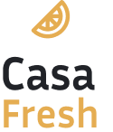
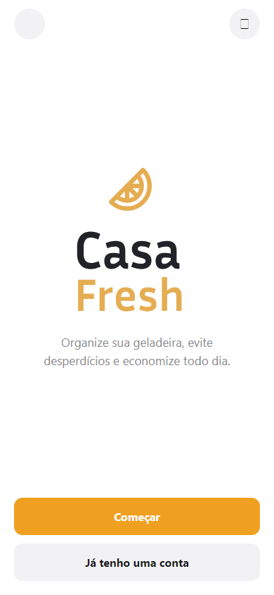

# 📑 Documentação do CasaFresh

<p align="center">
  
</p>

<p align="center">
  Organize sua geladeira, evite desperdícios e economize todo dia.
</p>

<p align="center">
  <a href="https://casa-fresh-eight.vercel.app/"></a>
  
  
  
  
</p>

## 📚 Visão Geral

Este documento descreve o **CasaFresh**: o que o aplicativo faz, como está organizado, como configurá-lo localmente e como publicar a versão web.

O CasaFresh é um aplicativo multiplataforma (**web**, **iOS** e **Android**) para famílias organizarem o estoque de alimentos em casa — validade, quantidade, localização e lista de compras —, com dados partilhados entre os membros da mesma casa (*household*).

Stack principal: **React Native**, **Expo**, **TypeScript** e **Supabase** (Auth, Postgres, Storage e RLS).

> Projeto / atividade desenvolvido na **Pós-Graduação Lato Sensu em Engenharia de Testes de Software com Inteligência Artificial**.

**Demo online:** [https://casa-fresh-eight.vercel.app/](https://casa-fresh-eight.vercel.app/)

### Sumário

- [Funcionalidades](#funcionalidades)
- [Screenshots](#screenshots)
- [Telas principais](#-telas-principais)
- [Arquitetura](#-arquitetura)
- [Modelo de dados](#-modelo-de-dados)
- [Estrutura do Projeto](#-estrutura-do-projeto)
- [Requisitos](#requisitos-para-rodar-localmente)
- [Instalação](#️-instalação)
- [Desenvolvimento](#desenvolvimento-com-recarga-automática)
- [Build e deploy](#compilação-para-produção-web)
- [Scripts npm](#-scripts-npm)
- [Tecnologias](#-tecnologias-utilizadas)
- [Recursos](#-recursos-adicionais)
- [Contribuição](#-contribuição)

### Funcionalidades

- **Estoque partilhado** — quantidade, unidade, local, categoria e data de validade
- **Alertas de validade** — produtos vencidos, a vencer ou em falta
- **Lista de compras** — itens manuais e sugestões com base no estoque
- **Família (household)** — convites por e-mail e gestão de membros
- **Fotos** — imagem do produto e avatar do perfil
- **Notificações in-app** — resumo de alertas no sino de notificações
- **Modo claro e escuro**
- **Autenticação** — cadastro e login com e-mail via Supabase Auth

### Screenshots

<p align="center">
  
</p>

## 📱 Telas principais

| Área | Rota / ficheiro | Descrição |
| --- | --- | --- |
| Boas-vindas | `src/app/index.tsx` | Apresentação, cadastro e login |
| Cadastro / Login | `src/app/(auth)/` | Autenticação com Supabase |
| Início | `src/app/(tabs)/inicio.tsx` | Resumo do estoque e “consumir primeiro” |
| Estoque | `src/app/(tabs)/estoque.tsx` | Lista, filtro e remoção de produtos |
| Adicionar | `src/app/(tabs)/adicionar.tsx` | Cadastro de novo alimento |
| Compras | `src/app/(tabs)/compras.tsx` | Lista de compras e sugestões |
| Mais | `src/app/(tabs)/mais.tsx` | Perfil, família, tema e sessão |
| Produto | `src/app/produto/[id]/` | Detalhe e edição |
| Notificações | `src/app/notificacoes.tsx` | Alertas de validade e falta |
| Sobre | `src/app/sobre.tsx` | Informações do app |

## 🏗 Arquitetura

O estado da aplicação é organizado em **React Contexts**:

| Context | Responsabilidade |
| --- | --- |
| `auth-context` | Sessão Supabase (login / logout / utilizador) |
| `products-context` | CRUD de produtos sincronizado com o household |
| `shopping-context` | Itens da lista de compras |
| `theme-context` | Tema claro / escuro e estilos tipados |

Camada `src/lib/`:

- `supabase.ts` — cliente Supabase e persistência de sessão
- `households.ts` — casa, membros, convites e perfil
- `products.ts` / `shopping.ts` — acesso aos dados remotos
- `bootstrap.ts` — carga inicial (household + produtos + compras)
- `notifications.ts` — geração de alertas a partir do estoque
- `storage.ts` / `pick-image.ts` — upload e seleção de imagens

Fluxo típico após o login:

1. Autenticação via Supabase Auth
2. Resolução / criação do *household* e sincronização de convites
3. Carregamento em paralelo de produtos e lista de compras
4. UI atualizada pelos contexts (Início, Estoque, Compras, alertas)

## 🗄 Modelo de dados

Tabelas principais definidas em `supabase/schema.sql`:

| Tabela | Conteúdo |
| --- | --- |
| `profiles` | Nome, e-mail e avatar do utilizador |
| `households` | Casa / família |
| `household_members` | Membros e papel (`admin` / `member`) |
| `household_invites` | Convites por e-mail |
| `products` | Estoque (nome, categoria, quantidade, validade, imagem…) |
| `shopping_items` | Itens da lista de compras |

**Status de produto** (calculado no cliente):

| Status | Significado |
| --- | --- |
| `ok` | Dentro da validade |
| `expiring` | Próximo do vencimento |
| `expired` | Vencido |
| `missing` | Em falta / quantidade zero |

O acesso é protegido por **Row Level Security (RLS)**: cada utilizador só vê e altera dados das casas a que pertence.

## 🗂 Estrutura do Projeto

```text
CasaFresh/
├── assets/                     # Imagens, ícones e splash
├── docs/
│   └── screenshots/            # Capturas de ecrã para documentação
├── src/                        # Código-fonte do projeto
│   ├── app/                    # Rotas (Expo Router — file-based)
│   │   ├── (auth)/             # Login e cadastro
│   │   │   ├── cadastro.tsx
│   │   │   ├── login.tsx
│   │   │   └── _layout.tsx
│   │   ├── (tabs)/             # Navegação principal
│   │   │   ├── inicio.tsx
│   │   │   ├── estoque.tsx
│   │   │   ├── compras.tsx
│   │   │   ├── adicionar.tsx
│   │   │   ├── mais.tsx
│   │   │   └── _layout.tsx
│   │   ├── produto/[id]/       # Detalhe e edição de produto
│   │   ├── index.tsx           # Ecrã de boas-vindas
│   │   ├── notificacoes.tsx
│   │   ├── sobre.tsx
│   │   └── _layout.tsx
│   ├── components/             # Componentes reutilizáveis
│   │   └── ui/                 # Button, TextField, Logo, etc.
│   ├── constants/              # Tema e tokens de design
│   ├── contexts/               # Auth, produtos, compras, tema
│   ├── hooks/                  # Hooks auxiliares
│   ├── lib/                    # Supabase, households, produtos, etc.
│   └── types/                  # Tipos TypeScript
├── supabase/
│   ├── schema.sql              # Tabelas, índices, RLS e helpers
│   └── storage.sql             # Storage de imagens
├── .env.example                # Exemplo de variáveis de ambiente
├── app.json                    # Configuração Expo
├── vercel.json                 # Build e rewrites do deploy web
├── package.json                # Dependências e scripts npm
└── README.md
```

## Requisitos para rodar localmente

### 🗃 Requisitos iniciais

Antes de iniciar o desenvolvimento, certifique-se de ter as seguintes ferramentas instaladas:

- [Node.js](https://nodejs.org/) (versão 18 ou superior)
- [npm](https://www.npmjs.com/) (gerenciador de pacotes do Node.js)
- Conta no [Supabase](https://supabase.com/)
- (Opcional) [Expo Go](https://expo.dev/go) ou emulador Android / iOS

## 🛠️ Instalação

### Instalação das Dependências

Para instalar todas as dependências necessárias, execute o seguinte comando no diretório raiz do projeto:

```bash
npm install
```

### Variáveis de ambiente

Copie o ficheiro de exemplo e preencha com as credenciais do seu projeto Supabase:

```bash
cp .env.example .env
```

```env
EXPO_PUBLIC_SUPABASE_URL=https://SEU_PROJETO.supabase.co
EXPO_PUBLIC_SUPABASE_ANON_KEY=SUA_ANON_KEY_AQUI
```

> Sem estas variáveis, a autenticação e a sincronização com a cloud não funcionam.

As chaves públicas (`EXPO_PUBLIC_*`) são embutidas no bundle do cliente. **Não** coloque a `service_role` key no app.

### Configuração do Supabase

1. Crie um projeto em [supabase.com](https://supabase.com/)
2. No **SQL Editor**, execute `supabase/schema.sql`
3. (Opcional) Execute `supabase/storage.sql` para uploads de imagens
4. Em **Authentication → Providers**, confirme que o login por e-mail está ativo
5. Copie a **Project URL** e a **anon key** (Settings → API) para o `.env`

O Supabase fornece:

- **Auth** — cadastro, login e sessão
- **Postgres** — perfis, households, membros, convites, produtos e compras
- **Row Level Security (RLS)** — acesso apenas aos dados da própria casa
- **Storage** — imagens dos produtos e avatares (quando configurado)

## Desenvolvimento com Recarga Automática

Para iniciar o servidor de desenvolvimento (Metro / Expo), utilize o comando:

```bash
npm start
```

No terminal, poderá abrir a aplicação em:

- Web
- Android
- iOS
- Expo Go (QR code)

### Plataformas específicas

```bash
npm run android
npm run ios
npm run web
```

### Tunnel (redes restritas)

```bash
npm run start:tunnel
```

## Compilação para Produção (Web)

Para gerar o export estático usado no deploy, execute:

```bash
npm run build
```

Este comando corresponde a `expo export --platform web` e gera a pasta `dist/`.

### Deploy na Vercel

A configuração está em `vercel.json`:

- **buildCommand:** `npm run build`
- **outputDirectory:** `dist`
- **rewrites:** SPA (`/(.*) → /index.html`)

A versão publicada está em [https://casa-fresh-eight.vercel.app/](https://casa-fresh-eight.vercel.app/).

No painel da Vercel, defina as mesmas variáveis `EXPO_PUBLIC_SUPABASE_URL` e `EXPO_PUBLIC_SUPABASE_ANON_KEY` do ambiente local.

## Verificação de Código

Para verificar problemas de formatação e lint no projeto, utilize:

```bash
npm run lint
```

## 🧾 Scripts npm

| Comando | Descrição |
| --- | --- |
| `npm start` | Inicia o Metro / Expo |
| `npm run start:tunnel` | Expo com tunnel (ngrok) |
| `npm run web` | Abre a versão web |
| `npm run android` | Abre no Android |
| `npm run ios` | Abre no iOS |
| `npm run build` | Export estático web (`dist/`) |
| `npm run lint` | Lint com ESLint (Expo) |

## 🌐 Tecnologias Utilizadas

### React Native + Expo

- **Descrição:** Framework para aplicações nativas multiplataforma com tooling e build unificados.
- **Uso:** Interface do CasaFresh em web, Android e iOS a partir do mesmo código.
- **Documentação:** [Expo Docs](https://docs.expo.dev/) · [React Native](https://reactnative.dev/)

### Expo Router

- **Descrição:** Navegação baseada em ficheiros (file-based routing).
- **Uso:** Organiza as rotas em `src/app/` (auth, tabs, produto, etc.).
- **Documentação:** [Expo Router](https://docs.expo.dev/router/introduction/)

### TypeScript

- **Descrição:** Superset tipado do JavaScript.
- **Uso:** Tipagem de produtos, contexts, APIs e componentes.
- **Documentação:** [TypeScript Docs](https://www.typescriptlang.org/docs/)

### Supabase

- **Descrição:** Backend-as-a-Service com Auth, Postgres, Storage e RLS.
- **Uso:** Autenticação, dados partilhados da família e imagens dos alimentos.
- **Documentação:** [Supabase Docs](https://supabase.com/docs)

### Vercel

- **Descrição:** Plataforma de deploy para aplicações web.
- **Uso:** Hospeda a versão web do CasaFresh.
- **Demo:** [https://casa-fresh-eight.vercel.app/](https://casa-fresh-eight.vercel.app/)

## 📖 Recursos Adicionais

Para obter mais informações e guias detalhados, confira os links abaixo:

- [Documentação do Expo](https://docs.expo.dev/)
- [Guia do Expo Router](https://docs.expo.dev/router/introduction/)
- [Documentação do Supabase](https://supabase.com/docs)
- [Documentação do React Native](https://reactnative.dev/)
- [Documentação do TypeScript](https://www.typescriptlang.org/docs/)
- [Demo CasaFresh (Vercel)](https://casa-fresh-eight.vercel.app/)

## 🤝 Contribuição

Se você deseja contribuir para o projeto, abra uma issue ou um pull request descrevendo a melhoria proposta. Mantenha o estilo de código existente e teste as alterações localmente antes de enviar.
